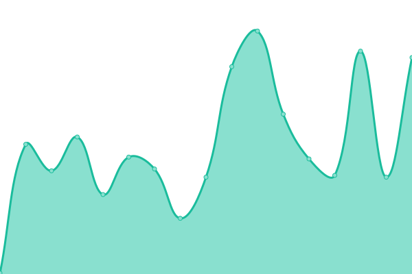

# [📈 Live Status](https://dhalldog.github.io/WCSD-Service-Status-Pages): <!--live status--> **🟩 All systems operational**

This repository contains the open-source uptime monitor and status page for [Daniel](https://dhalldog.github.io/WCSD-Service-Status-Pages), powered by [Upptime](https://github.com/upptime/upptime).

With [Upptime](https://upptime.js.org), you can get your own unlimited and free uptime monitor and status page, powered entirely by a GitHub repository. We use [Issues](https://github.com/dhalldog/WCSD-Service-Status-Pages/issues) as incident reports, [Actions](https://github.com/dhalldog/WCSD-Service-Status-Pages/actions) as uptime monitors, and [Pages](https://dhalldog.github.io/WCSD-Service-Status-Pages) for the status page.

<!--start: status pages-->
<!-- This summary is generated by Upptime (https://github.com/upptime/upptime) -->
<!-- Do not edit this manually, your changes will be overwritten -->
<!-- prettier-ignore -->
| URL | Status | History | Response Time | Uptime |
| --- | ------ | ------- | ------------- | ------ |
|  [Google](https://www.google.com) | 🟩 Up | [google.yml](https://github.com/dhalldog/WCSD-Service-Status-Pages/commits/HEAD/history/google.yml) | 

 103ms
     
 | 

<a href="https://dhalldog.github.io/WCSD-Service-Status-Pages/history/google">100.00%</a>
    

|  [Apple](https://www.apple.com/) | 🟩 Up | [apple.yml](https://github.com/dhalldog/WCSD-Service-Status-Pages/commits/HEAD/history/apple.yml) | 

 130ms
     
 | 

<a href="https://dhalldog.github.io/WCSD-Service-Status-Pages/history/apple">100.00%</a>
    

|  [Canvas](https://www.instructure.com/) | 🟩 Up | [canvas.yml](https://github.com/dhalldog/WCSD-Service-Status-Pages/commits/HEAD/history/canvas.yml) | 

 123ms
     
 | 

<a href="https://dhalldog.github.io/WCSD-Service-Status-Pages/history/canvas">95.26%</a>
    

|  [Jamf Pro](https://waukeecommsd.jamfcloud.com/) | 🟩 Up | [jamf-pro.yml](https://github.com/dhalldog/WCSD-Service-Status-Pages/commits/HEAD/history/jamf-pro.yml) | 

 333ms
     
 | 

<a href="https://dhalldog.github.io/WCSD-Service-Status-Pages/history/jamf-pro">100.00%</a>
    

|  [Mosyle](https://myschool.mosyle.com/#) | 🟩 Up | [mosyle.yml](https://github.com/dhalldog/WCSD-Service-Status-Pages/commits/HEAD/history/mosyle.yml) | 

 7020ms
     
 | 

<a href="https://dhalldog.github.io/WCSD-Service-Status-Pages/history/mosyle">100.00%</a>
    

|  [Clever](https://www.clever.com/) | 🟩 Up | [clever.yml](https://github.com/dhalldog/WCSD-Service-Status-Pages/commits/HEAD/history/clever.yml) | 

 233ms
     
 | 

<a href="https://dhalldog.github.io/WCSD-Service-Status-Pages/history/clever">100.00%</a>
    

|  [Minga](https://status.minga.io/) | 🟩 Up | [minga.yml](https://github.com/dhalldog/WCSD-Service-Status-Pages/commits/HEAD/history/minga.yml) | 

 467ms
     
 | 

<a href="https://dhalldog.github.io/WCSD-Service-Status-Pages/history/minga">100.00%</a>
    

<!--end: status pages-->

[**Visit our status website →**](https://dhalldog.github.io/WCSD-Service-Status-Pages)

## 📄 License

- Powered by: [Upptime](https://github.com/upptime/upptime)
- Code: [MIT](./LICENSE) © [Anand Chowdhary](https://anandchowdhary.com), supported by [Pabio](https://pabio.com)
- Data in the `./history` directory: [Open Database License](https://opendatacommons.org/licenses/odbl/1-0/)
