# [📈 Live Status](https://dhalldog.github.io/WCSD-Service-Status-Pages): <!--live status--> **🟩 All systems operational**

This repository contains the open-source uptime monitor and status page for [Daniel](https://dhalldog.github.io/WCSD-Service-Status-Pages), powered by [Upptime](https://github.com/upptime/upptime).

With [Upptime](https://upptime.js.org), you can get your own unlimited and free uptime monitor and status page, powered entirely by a GitHub repository. We use [Issues](https://github.com/dhalldog/WCSD-Service-Status-Pages/issues) as incident reports, [Actions](https://github.com/dhalldog/WCSD-Service-Status-Pages/actions) as uptime monitors, and [Pages](https://dhalldog.github.io/WCSD-Service-Status-Pages) for the status page.

<!--start: status pages-->
<!-- This summary is generated by Upptime (https://github.com/upptime/upptime) -->
<!-- Do not edit this manually, your changes will be overwritten -->
<!-- prettier-ignore -->
| URL | Status | History | Response Time | Uptime |
| --- | ------ | ------- | ------------- | ------ |
|  [Amazon(AWS)](https://aws.amazon.com/) | 🟩 Up | [amazon-aws.yml](https://github.com/dhalldog/WCSD-Service-Status-Pages/commits/HEAD/history/amazon-aws.yml) | 

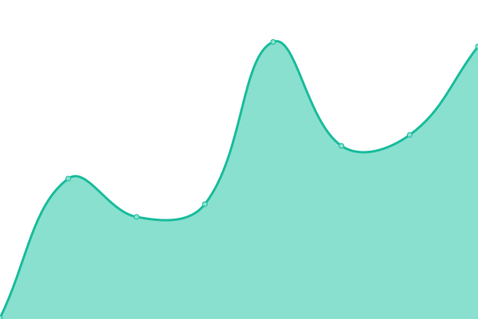 820ms
     
 | 

<a href="https://dhalldog.github.io/WCSD-Service-Status-Pages/history/amazon-aws">100.00%</a>
    

|  [Amplify](https://amplify.com) | 🟩 Up | [amplify.yml](https://github.com/dhalldog/WCSD-Service-Status-Pages/commits/HEAD/history/amplify.yml) | 

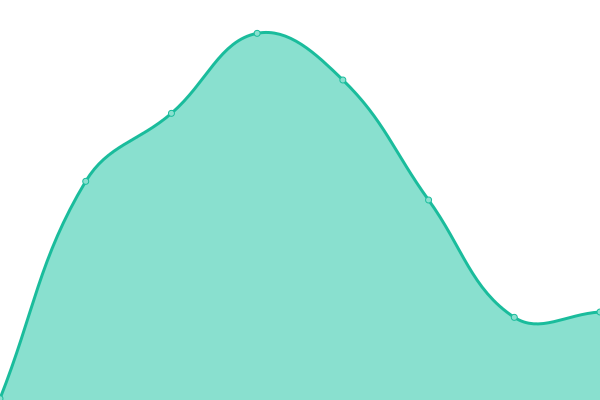 228ms
     
 | 

<a href="https://dhalldog.github.io/WCSD-Service-Status-Pages/history/amplify">100.00%</a>
    

|  [Apple](https://www.apple.com/) | 🟩 Up | [apple.yml](https://github.com/dhalldog/WCSD-Service-Status-Pages/commits/HEAD/history/apple.yml) | 

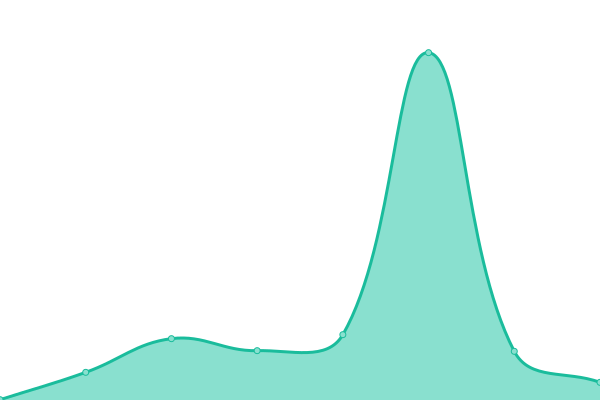 131ms
     
 | 

<a href="https://dhalldog.github.io/WCSD-Service-Status-Pages/history/apple">100.00%</a>
    

|  [Apple School Manager](https://school.apple.com/#/main/users) | 🟩 Up | [apple-school-manager.yml](https://github.com/dhalldog/WCSD-Service-Status-Pages/commits/HEAD/history/apple-school-manager.yml) | 

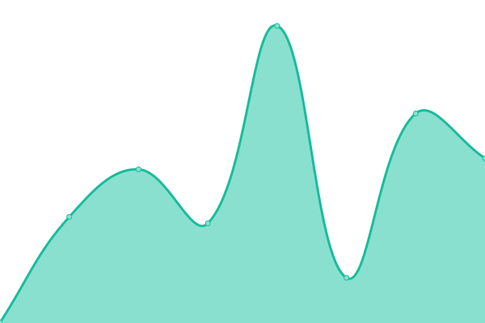 248ms
     
 | 

<a href="https://dhalldog.github.io/WCSD-Service-Status-Pages/history/apple-school-manager">100.00%</a>
    

|  [Claris Connect](https://connect.claris.com/login) | 🟩 Up | [claris-connect.yml](https://github.com/dhalldog/WCSD-Service-Status-Pages/commits/HEAD/history/claris-connect.yml) | 

 312ms
     
 | 

<a href="https://dhalldog.github.io/WCSD-Service-Status-Pages/history/claris-connect">100.00%</a>
    

|  [Class Kick](https://classkick.com/) | 🟩 Up | [class-kick.yml](https://github.com/dhalldog/WCSD-Service-Status-Pages/commits/HEAD/history/class-kick.yml) | 

 172ms
     
 | 

<a href="https://dhalldog.github.io/WCSD-Service-Status-Pages/history/class-kick">100.00%</a>
    

|  [Clever](https://www.clever.com/) | 🟩 Up | [clever.yml](https://github.com/dhalldog/WCSD-Service-Status-Pages/commits/HEAD/history/clever.yml) | 

 278ms
     
 | 

<a href="https://dhalldog.github.io/WCSD-Service-Status-Pages/history/clever">100.00%</a>
    

|  [Cloud Flare](https://www.cloudflare.com/) | 🟩 Up | [cloud-flare.yml](https://github.com/dhalldog/WCSD-Service-Status-Pages/commits/HEAD/history/cloud-flare.yml) | 

 657ms
     
 | 

<a href="https://dhalldog.github.io/WCSD-Service-Status-Pages/history/cloud-flare">99.81%</a>
    

|  [Delta Math](https://www.deltamath.com/) | 🟩 Up | [delta-math.yml](https://github.com/dhalldog/WCSD-Service-Status-Pages/commits/HEAD/history/delta-math.yml) | 

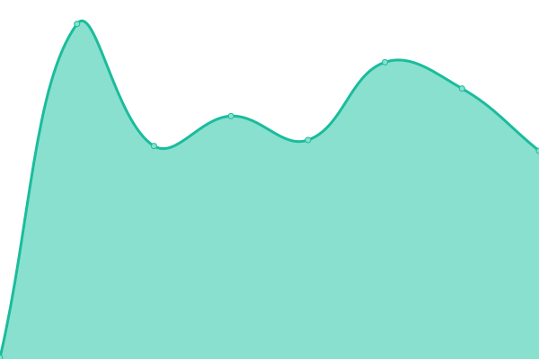 213ms
     
 | 

<a href="https://dhalldog.github.io/WCSD-Service-Status-Pages/history/delta-math">99.80%</a>
    

|  [EdPuzzle](https://edpuzzle.com/) | 🟩 Up | [ed-puzzle.yml](https://github.com/dhalldog/WCSD-Service-Status-Pages/commits/HEAD/history/ed-puzzle.yml) | 

 171ms
     
 | 

<a href="https://dhalldog.github.io/WCSD-Service-Status-Pages/history/ed-puzzle">99.67%</a>
    

|  [Frontline](https://app.frontlineeducation.com/) | 🟩 Up | [frontline.yml](https://github.com/dhalldog/WCSD-Service-Status-Pages/commits/HEAD/history/frontline.yml) | 

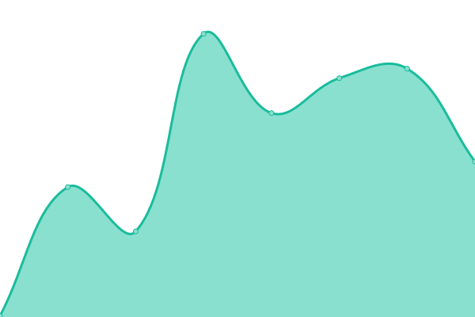 217ms
     
 | 

<a href="https://dhalldog.github.io/WCSD-Service-Status-Pages/history/frontline">100.00%</a>
    

|  [Google](https://www.google.com) | 🟩 Up | [google.yml](https://github.com/dhalldog/WCSD-Service-Status-Pages/commits/HEAD/history/google.yml) | 

 131ms
     
 | 

<a href="https://dhalldog.github.io/WCSD-Service-Status-Pages/history/google">100.00%</a>
    

|  [Jamf Pro](https://waukeecommsd.jamfcloud.com/) | 🟩 Up | [jamf-pro.yml](https://github.com/dhalldog/WCSD-Service-Status-Pages/commits/HEAD/history/jamf-pro.yml) | 

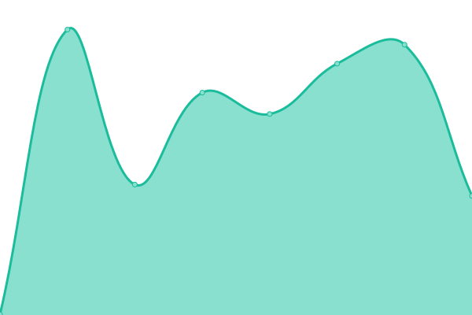 381ms
     
 | 

<a href="https://dhalldog.github.io/WCSD-Service-Status-Pages/history/jamf-pro">99.67%</a>
    

|  [Khan Academy](https://www.khanacademy.org/) | 🟩 Up | [khan-academy.yml](https://github.com/dhalldog/WCSD-Service-Status-Pages/commits/HEAD/history/khan-academy.yml) | 

 409ms
     
 | 

<a href="https://dhalldog.github.io/WCSD-Service-Status-Pages/history/khan-academy">100.00%</a>
    

|  [Learning Ally](https://learningally.org/) | 🟩 Up | [learning-ally.yml](https://github.com/dhalldog/WCSD-Service-Status-Pages/commits/HEAD/history/learning-ally.yml) | 

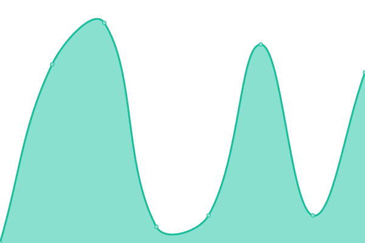 880ms
     
 | 

<a href="https://dhalldog.github.io/WCSD-Service-Status-Pages/history/learning-ally">99.67%</a>
    

|  [MackinVIA](https://mackinvia.com/) | 🟩 Up | [mackin-via.yml](https://github.com/dhalldog/WCSD-Service-Status-Pages/commits/HEAD/history/mackin-via.yml) | 

 447ms
     
 | 

<a href="https://dhalldog.github.io/WCSD-Service-Status-Pages/history/mackin-via">100.00%</a>
    

|  [McGraw Hill](https://www.mheducation.com/) | 🟩 Up | [mc-graw-hill.yml](https://github.com/dhalldog/WCSD-Service-Status-Pages/commits/HEAD/history/mc-graw-hill.yml) | 

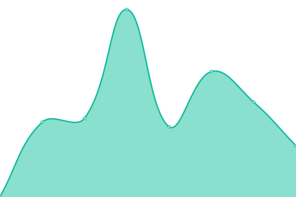 322ms
     
 | 

<a href="https://dhalldog.github.io/WCSD-Service-Status-Pages/history/mc-graw-hill">99.67%</a>
    

|  [Minga](https://status.minga.io/) | 🟩 Up | [minga.yml](https://github.com/dhalldog/WCSD-Service-Status-Pages/commits/HEAD/history/minga.yml) | 

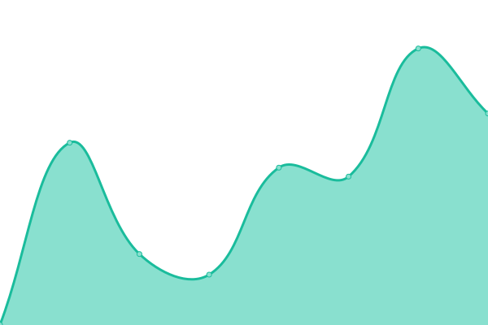 848ms
     
 | 

<a href="https://dhalldog.github.io/WCSD-Service-Status-Pages/history/minga">99.10%</a>
    

|  [Mosyle](https://myschool.mosyle.com/) | 🟩 Up | [mosyle.yml](https://github.com/dhalldog/WCSD-Service-Status-Pages/commits/HEAD/history/mosyle.yml) | 

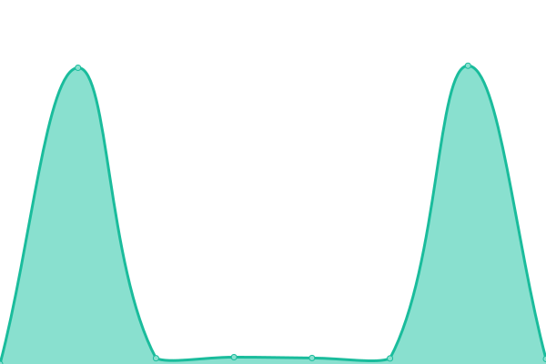 5350ms
     
 | 

<a href="https://dhalldog.github.io/WCSD-Service-Status-Pages/history/mosyle">100.00%</a>
    

|  [NIM](https://www.tools4ever.com/nim/) | 🟩 Up | [nim.yml](https://github.com/dhalldog/WCSD-Service-Status-Pages/commits/HEAD/history/nim.yml) | 

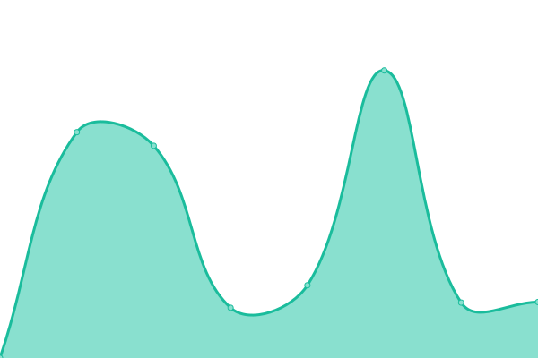 1055ms
     
 | 

<a href="https://dhalldog.github.io/WCSD-Service-Status-Pages/history/nim">99.84%</a>
    

|  [OKTA](https://waukeeschools.okta.com/) | 🟩 Up | [okta.yml](https://github.com/dhalldog/WCSD-Service-Status-Pages/commits/HEAD/history/okta.yml) | 

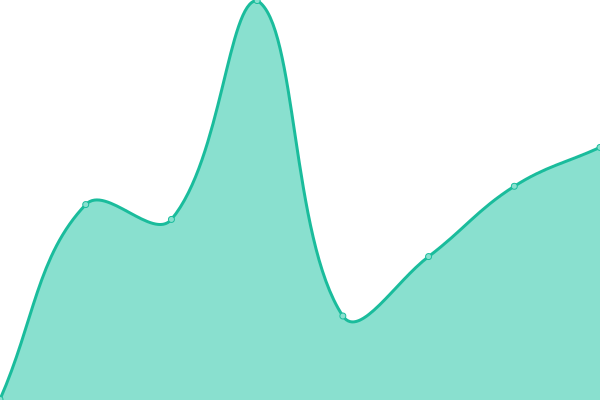 443ms
     
 | 

<a href="https://dhalldog.github.io/WCSD-Service-Status-Pages/history/okta">100.00%</a>
    

|  [Pearson](https://www.pearson.com/) | 🟩 Up | [pearson.yml](https://github.com/dhalldog/WCSD-Service-Status-Pages/commits/HEAD/history/pearson.yml) | 

 534ms
     
 | 

<a href="https://dhalldog.github.io/WCSD-Service-Status-Pages/history/pearson">100.00%</a>
    

|  [PowerSchool](https://waukee.powerschool.com/public/) | 🟩 Up | [power-school.yml](https://github.com/dhalldog/WCSD-Service-Status-Pages/commits/HEAD/history/power-school.yml) | 

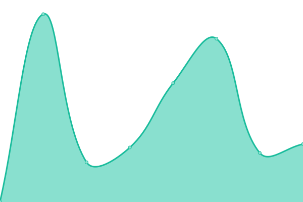 268ms
     
 | 

<a href="https://dhalldog.github.io/WCSD-Service-Status-Pages/history/power-school">100.00%</a>
    

|  [Quill](quill.org) | 🟩 Up | [quill.yml](https://github.com/dhalldog/WCSD-Service-Status-Pages/commits/HEAD/history/quill.yml) | 

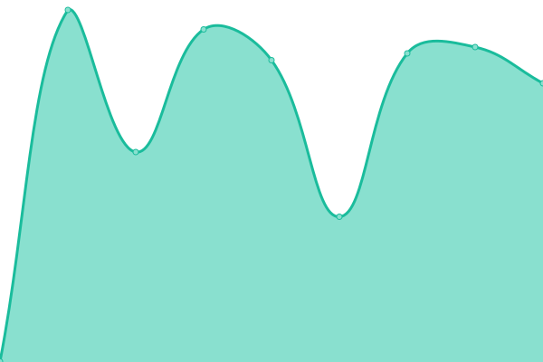 722ms
     
 | 

<a href="https://dhalldog.github.io/WCSD-Service-Status-Pages/history/quill">100.00%</a>
    

|  [Savvas](https://www.savvas.com/) | 🟩 Up | [savvas.yml](https://github.com/dhalldog/WCSD-Service-Status-Pages/commits/HEAD/history/savvas.yml) | 

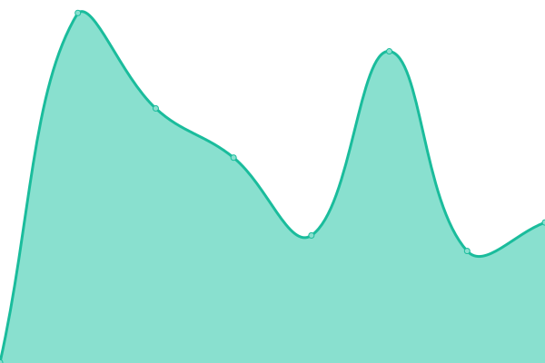 512ms
     
 | 

<a href="https://dhalldog.github.io/WCSD-Service-Status-Pages/history/savvas">99.68%</a>
    

|  [Securly](https://securly.status.io/) | 🟩 Up | [securly.yml](https://github.com/dhalldog/WCSD-Service-Status-Pages/commits/HEAD/history/securly.yml) | 

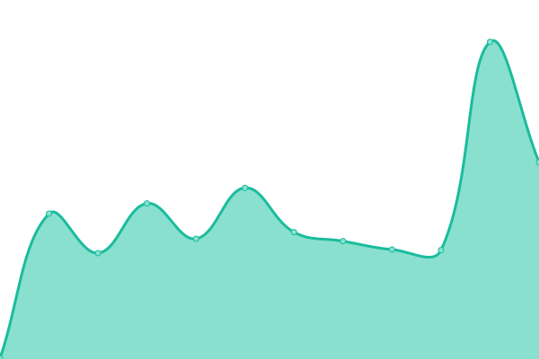 306ms
     
 | 

<a href="https://dhalldog.github.io/WCSD-Service-Status-Pages/history/securly">100.00%</a>
    

|  [Seesaw](https://seesaw.com/) | 🟩 Up | [seesaw.yml](https://github.com/dhalldog/WCSD-Service-Status-Pages/commits/HEAD/history/seesaw.yml) | 

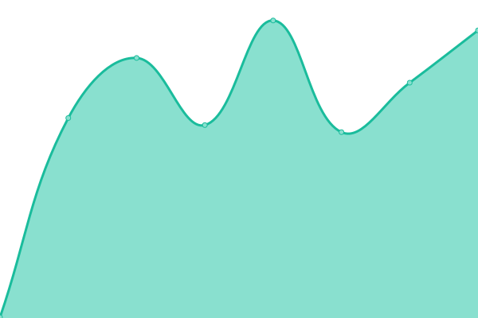 259ms
     
 | 

<a href="https://dhalldog.github.io/WCSD-Service-Status-Pages/history/seesaw">100.00%</a>
    

|  [WCSD Tickets](https://ticket.waukeeschools.org/staff/tickets/) | 🟩 Up | [wcsd-tickets.yml](https://github.com/dhalldog/WCSD-Service-Status-Pages/commits/HEAD/history/wcsd-tickets.yml) | 

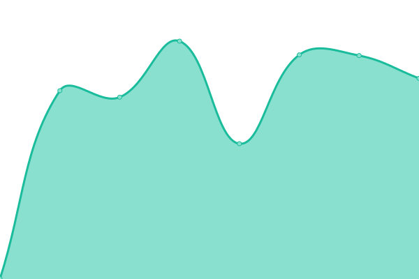 1003ms
     
 | 

<a href="https://dhalldog.github.io/WCSD-Service-Status-Pages/history/wcsd-tickets">99.80%</a>
    

|  [WCSD Website](https://www.waukeeschools.org/) | 🟩 Up | [wcsd-website.yml](https://github.com/dhalldog/WCSD-Service-Status-Pages/commits/HEAD/history/wcsd-website.yml) | 

 427ms
     
 | 

<a href="https://dhalldog.github.io/WCSD-Service-Status-Pages/history/wcsd-website">98.71%</a>
    

|  [Visitor Aware](https://status.singlewire.com/) | 🟩 Up | [visitor-aware.yml](https://github.com/dhalldog/WCSD-Service-Status-Pages/commits/HEAD/history/visitor-aware.yml) | 

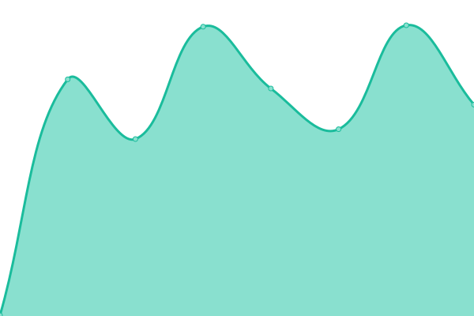 396ms
     
 | 

<a href="https://dhalldog.github.io/WCSD-Service-Status-Pages/history/visitor-aware">99.68%</a>
    

|  [YouTube](https://www.youtube.com/) | 🟩 Up | [you-tube.yml](https://github.com/dhalldog/WCSD-Service-Status-Pages/commits/HEAD/history/you-tube.yml) | 

 331ms
     
 | 

<a href="https://dhalldog.github.io/WCSD-Service-Status-Pages/history/you-tube">100.00%</a>
    

<!--end: status pages-->

[**Visit our status website →**](https://dhalldog.github.io/WCSD-Service-Status-Pages)

## 📄 License

- Powered by: [Upptime](https://github.com/upptime/upptime)
- Code: [MIT](./LICENSE) © [Anand Chowdhary](https://anandchowdhary.com), supported by [Pabio](https://pabio.com)
- Data in the `./history` directory: [Open Database License](https://opendatacommons.org/licenses/odbl/1-0/)
